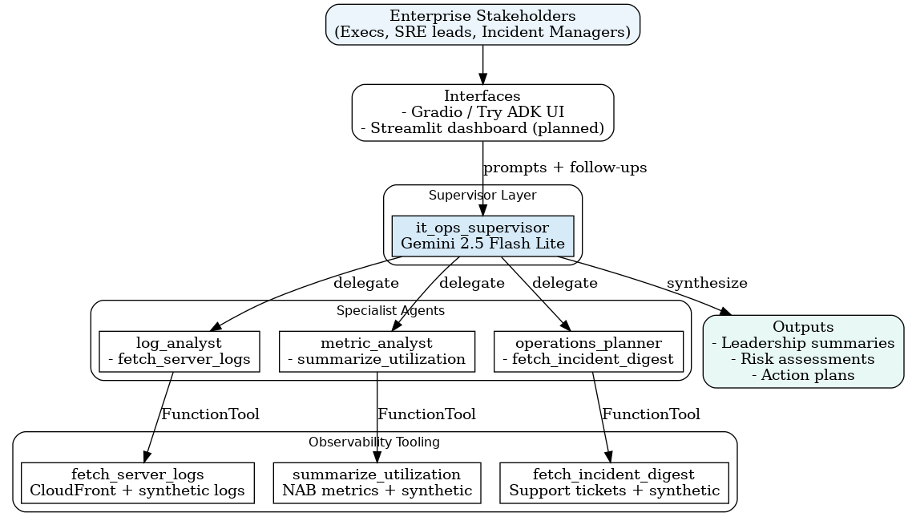

# Enterprise IT Operations Agent - Capstone Project

**Goal:** Build a Collaborative Multi-Agent System (Level 3) with aspirations for Self-Evolution (Level 4) to analyze IT infrastructure data.

## Problem Statement & Success Metrics
**Business Problem.** Enterprise IT operations teams spend hours correlating fragmented telemetry (logs, metrics, incident emails) before they can brief leadership or execute a mitigation plan. The manual triage loop inflates mean time to resolution (MTTR), delays capacity planning, and leaves SLO violations unreported until customers escalate.

**Solution Overview.** A Gemini-powered ADK supervisor agent coordinates log, metric, and SLA specialists to deliver an operations command center: ingest multi-source telemetry, surface root-cause narratives, recommend remediation windows, and generate executive-ready summaries within minutes.

> For the full background narrative that inspired this project, see [`docs/mission_background.md`](docs/mission_background.md).

**Success Metrics.**
- **MTTR Insight Turnaround:** Produce an actionable incident synopsis (root cause + next action) within 5 minutes of ingestion in >90% of synthetic incident runs (baseline manual analysis ≈ 35 minutes).
- **SLO Breach Detection Recall:** Identify ≥90% of simulated SLA violations across logs/metrics with ≤10% false-positive rate, evaluated via labeled synthetic workloads and Kaggle datasets.
- **Executive Briefing Velocity:** Generate stakeholder-ready summaries (≤3 paragraphs + bullet plan) in under 2 minutes of user request, validated with timed runs in Try ADK web/Gradio UI.
- **Capacity Risk Forecasting Accuracy:** Maintain ≤15% MAPE when projecting 24-hour CPU/memory trends, using hold-out windows from the selected metrics dataset.

## Architecture Snapshot
1. **Data Layer:** Ingest logs, metrics, and communications from Kaggle datasets plus synthetic generators into normalized formats.
2. **Agent Layer:**
    - **Supervisor (`it_ops_supervisor`):** Interprets intent, delegates to specialists, synthesizes responses.
    - **Log Analyst:** Detects anomalies and root causes within normalized log windows.
    - **Metric Analyst:** Summarizes utilization trends and forecasts capacity risks.
    - **Operations Planner:** Combines incident communications with telemetry to propose remediation windows and stakeholder messaging.
3. **Interface Layer:** Notebook experiments → Gradio prototype → Try ADK web → future Streamlit/Cloud Run deployment.



> Evidence bundle: [pytest run screenshot](assets/screenshots/pytest_pass.png), [evaluation notebook transcript](assets/screenshots/evaluation_notebook_run.png), [latest verbose transcript](reports/evaluation/examples/2025-11-28_adk_supervisor_verbose_run_v2.txt).

> Detailed diagrams, tool inventories, and deployment roadmap: [`docs/architecture_overview.md`](docs/architecture_overview.md).

## Data Sources
We will blend public datasets with controllable synthetic generators to give the agents realistic yet reproducible signals. A detailed breakdown (including download commands and schema notes) lives in [`docs/data_sources.md`](docs/data_sources.md).

- **Cloud access logs:** Kaggle dataset `paultimothymooney/amazon-cloudfront-logs` → sampled HTTP request logs with status codes and edge locations for log anomaly detection.
- **Infrastructure metrics:** Kaggle dataset `numenta/NAB` (Numenta Anomaly Benchmark) → CPU and memory telemetry used for capacity trending and SLA breach detection.
- **Support communications:** Kaggle dataset `aslanahmedov/tech-support-ticket-classification` → customer/stakeholder ticket text that feeds the incident triage agent.
- **Synthetic augmentation:** Deterministic generators expand coverage for rare events (database fails, migration windows, vendor outage emails) and allow stress-testing Level 4 behaviors.

## Agent Tooling
The supervisor and specialists share three `FunctionTool` wrappers exposed from `src/it_ops_observability/tools.py`, giving the LLM concrete affordances when reasoning about observability tasks.

- **`fetch_server_logs`** – retrieves recent CloudFront-style log lines for a server and falls back to synthetic bursts when curated parquet files are unavailable.
- **`summarize_utilization`** – aggregates CPU and memory telemetry, returning averages, peaks, and timestamped samples that downstream prompts can cite.
- **`fetch_incident_digest`** – surfaces the latest support ticket or synthesizes a SEV2 incident email so remediation plans always include stakeholder context.

These tools automatically load real datasets when present and revert to deterministic generators otherwise, keeping evaluation runs reproducible across local, Kaggle, and cloud environments.

## Local Runner
Use `scripts/run_adk_supervisor.py` to exercise the production agent tree with Gemini. This mirrors the evaluation workflow and generates transcripts for the Kaggle write-up.

```
source .venv/bin/activate
set -a && source .env && set +a  # loads GOOGLE_API_KEY
PYTHONPATH=src python scripts/run_adk_supervisor.py --verbose \
    "Give me an ops briefing: what happened overnight, what are the top risks, and what should leadership do next?" \
    "Investigate prod-app-01 with the default window and summarize key log anomalies." \
    "Provide the utilization stats and risks." \
    "Draft the leadership summary and actions."
```

Use `--quiet` to skip console logs and capture the returned events programmatically.

## Streamlit Command Center
Launch the streamlined UI to demo the supervisor without touching the CLI:

```
source .venv/bin/activate
set -a && source .env && set +a
PYTHONPATH=src streamlit run ui/streamlit_app.py
```

The page accepts one prompt per line (preloaded with the standard leadership briefing flow), streams responses from each agent, and keeps the transcript in the browser for screenshotting. Verbose mode surfaces tool traces so reviewers can see delegation in action.

## Rubric Coverage Plan
We track rubric alignment in [`docs/rubric_mapping.md`](docs/rubric_mapping.md), mapping every required feature (multi-agent, tools, memory, observability, deployment, documentation, bonus points) to concrete deliverables and current status.

## Evaluation Plan
Success metrics, datasets, scenarios, and reporting expectations are documented in [`docs/evaluation_plan.md`](docs/evaluation_plan.md). The forthcoming evaluation notebook and tests will follow this blueprint.

### Evaluation Notebook
Run `notebooks/evaluation/run_evaluation.ipynb` to reproduce the Gemini-backed supervisor transcript used in our evidence pack.

1. `source .venv/bin/activate`
2. Ensure `.env` includes `GOOGLE_API_KEY` and any other required configuration.
3. Open the notebook and execute the single code cell. It loads env vars, sets `PYTHONPATH=src`, and shells out to `python scripts/run_adk_supervisor.py --verbose ...`.
4. Capture the printed STDOUT/STDERR into `reports/evaluation/examples/` or your own artifact directory for submission.

The notebook automatically preserves any env vars already exported, so it is safe to rerun after rotating keys or toggling models.

### Evidence Snapshot (2025-11-28)
| Evidence | Status | Artifacts |
| --- | --- | --- |
| Pytest regression suite | 4 tests passing in 10.7s real time (warnings from upstream deprecation only) | [tests/test_runner.py](tests/test_runner.py), [pytest screenshot](assets/screenshots/pytest_pass.png) |
| Evaluation notebook run | Supervisor transcript captured with stdout/stderr; `/usr/bin/time` measured 10.0s wall-clock, 3.5s CPU | [notebook](notebooks/evaluation/run_evaluation.ipynb), [screenshot](assets/screenshots/evaluation_notebook_run.png), [transcript](reports/evaluation/examples/2025-11-28_adk_supervisor_verbose_run_v2.txt) |
| Architecture diagram | Programmatically generated using Graphviz on 2025-11-28 | [diagram](assets/enterprise_it_ops_architecture.png), [generator script](scripts/generate_architecture_diagram.py) |
| Success metric instrumentation | Utilization sample: avg CPU 54.83%, peak 78.60%; avg memory 62.34%, peak 73.51 (24h synthetic window) | [evaluation plan](docs/evaluation_plan.md), [submission outline](docs/submission_outline.md), [metrics JSON](reports/evaluation/examples/metrics_2025-11-29.json) |

## Setup
1.  Install dependencies: `pip install -r requirements.txt`
2.  Set up Google Cloud credentials.

## Deployment

Detailed rollout steps for Try ADK web, Streamlit, and Cloud Run live in [`docs/deployment_strategy.md`](docs/deployment_strategy.md). A full deployment guide with commands will be produced during implementation.

Cost assumptions, free-tier considerations, and a bill of materials table are captured in [`docs/cost_estimate.md`](docs/cost_estimate.md).

## Planning Checklist
- [x] Finalize the detailed problem statement and success metrics (e.g., MTTR reduction, SLA adherence).
- [x] Select and document the exact datasets for logs, metrics, and communications (synthetic vs Kaggle sources) with access/setup notes.
- [x] Produce an architecture brief covering agent hierarchy, tool flows, memory/session strategy, and observability hooks (include diagrams).
- [x] Map rubric features to planned implementations (tools, multi-agent, memory/evaluation/deployment) and validate coverage of ≥3 required concepts.
- [x] Define an evaluation plan (datasets, metrics, ADK eval scripts) and create a reproducible testing checklist.
- [x] Flesh out deployment approach (Streamlit/ADK web/Cloud Run) with configuration steps and environment requirements.
- [x] Draft documentation deliverables: README sections, architecture doc, setup guide, and submission write-up outline.
- [ ] Plan storytelling assets: outline the LinkedIn blog post, capture visuals, and script the submission video.
- [ ] Verify compliance tasks: secret handling policy, licensing notes, and contribution guidelines for collaborators.
- [ ] Schedule milestone timeline leading to Kaggle submission, including buffer for review and polish.

